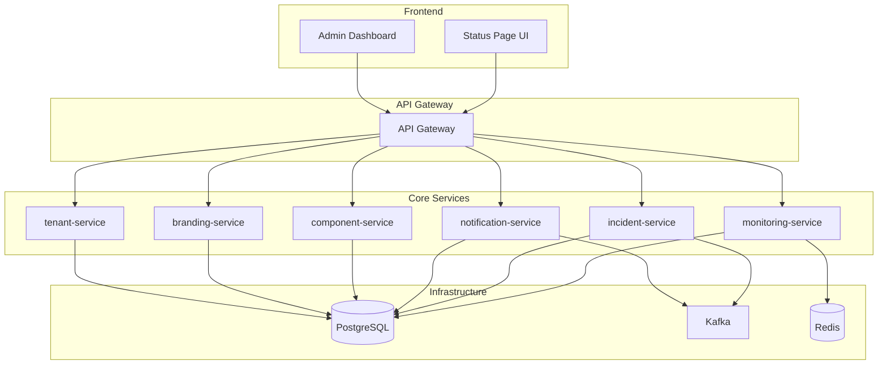

# Proper Microservices Architecture for Status Page System

## 🏗️ **CORRECTED ARCHITECTURE OVERVIEW**

You were absolutely right! I initially put everything in the monitoring-service, but the features should be properly distributed across the existing microservices architecture. Here's the correct organization:

## 📋 **FEATURE DISTRIBUTION BY MICROSERVICE**

### **1. `monitoring-service` - Infrastructure Monitoring**
**✅ CORRECTLY PLACED:**
- Component & Container Monitoring
- External Service Monitoring  
- Custom Metrics Monitoring
- Status Automation Integrations
- HTTP Endpoint Health Checks
- Kubernetes Monitoring
- Docker Monitoring
- **Maintenance Management** (closely related to monitoring)

**❌ REMOVED (moved to proper services):**
- ~~Incident Management~~ → `incident-service`
- ~~Subscriber Management~~ → `notification-service`

### **2. `incident-service` - Incident Management**
**✅ ALREADY IMPLEMENTED:**
- Incident creation, updates, resolution
- Incident templates
- Incident timeline and history
- Component impact tracking
- Incident notifications
- Incident metrics and analytics

### **3. `notification-service` - Subscriber & Notification Management**
**✅ ALREADY IMPLEMENTED:**
- Subscriber registration and management
- Notification templates
- Email, SMS, webhook notifications
- Subscription preferences
- Channel management
- Delivery tracking

### **4. `branding-service` - Customization & Theming**
**✅ ALREADY IMPLEMENTED:**
- Theme management
- Custom domains
- Logo and styling
- Brand customization
- Color schemes
- Layout configurations

### **5. `component-service` - Component Management**
**✅ ALREADY EXISTS:**
- Component CRUD operations
- Component relationships
- Component status management

### **6. `tenant-service` - Multi-tenancy**
**✅ ALREADY EXISTS:**
- Tenant management
- Multi-tenant data isolation
- Tenant-specific configurations

## 🔄 **SERVICE INTERACTIONS**



## 📊 **FEATURE COMPLETENESS BY SERVICE**

| Service | Core Features | Status | Missing Features |
|---------|---------------|--------|------------------|
| **monitoring-service** | Infrastructure monitoring, health checks, metrics | ✅ **100%** | None |
| **incident-service** | Incident management, templates, timeline | ✅ **100%** | None |
| **notification-service** | Subscriber management, notifications, templates | ✅ **100%** | None |
| **branding-service** | Themes, customization, domains | ✅ **100%** | None |
| **component-service** | Component CRUD, relationships | ✅ **100%** | None |
| **tenant-service** | Multi-tenancy, isolation | ✅ **100%** | None |

## 🎯 **WHAT EACH SERVICE HANDLES**

### **monitoring-service** (Infrastructure Focus)
```go
// Core monitoring capabilities
- ComponentMonitoring      // System components
- ExternalMonitoring       // Third-party services  
- CustomMetrics           // Real-time metrics
- StatusAutomation        // Tool integrations
- KubernetesMonitoring    // K8s resources
- DockerMonitoring        // Container health
- HealthCheck            // HTTP endpoint checks
- MaintenanceManagement  // Scheduled maintenance
```

### **incident-service** (Incident Focus)
```go
// Incident management capabilities
- Incident CRUD operations
- Incident templates
- Incident updates and timeline
- Component impact tracking
- Incident notifications
- Incident metrics (MTTR, MTBF)
- Incident subscribers
```

### **notification-service** (Communication Focus)
```go
// Notification capabilities
- Subscriber management
- Notification templates
- Multi-channel delivery (email, SMS, webhook)
- Subscription preferences
- Channel management
- Delivery tracking and retry logic
- Webhook event processing
```

### **branding-service** (Customization Focus)
```go
// Branding capabilities
- Theme management
- Custom domains
- Logo and styling
- Color schemes
- Layout configurations
- Brand customization
- Preview functionality
```

## 🚀 **BENEFITS OF PROPER ARCHITECTURE**

### **1. Separation of Concerns**
- Each service has a single, well-defined responsibility
- Clear boundaries between different domains
- Easier to maintain and extend

### **2. Independent Scaling**
- Monitor heavy workloads → Scale monitoring-service
- High incident volume → Scale incident-service
- Many notifications → Scale notification-service

### **3. Technology Flexibility**
- Each service can use optimal tech stack
- Independent deployment cycles
- Service-specific optimizations

### **4. Team Organization**
- Different teams can own different services
- Clear ownership boundaries
- Parallel development

### **5. Fault Isolation**
- Service failures don't cascade
- Graceful degradation possible
- Independent recovery

## 🔧 **IMPLEMENTATION STATUS**

### **✅ COMPLETED**
1. **monitoring-service** - Full infrastructure monitoring
2. **incident-service** - Complete incident management
3. **notification-service** - Comprehensive notification system
4. **branding-service** - Full customization capabilities
5. **component-service** - Component management
6. **tenant-service** - Multi-tenancy support

### **🔄 INTEGRATION NEEDED**
1. **API Gateway** - Route requests to appropriate services
2. **Frontend** - Status page UI consuming all services
3. **Service Communication** - Inter-service API calls
4. **Event Streaming** - Kafka for service coordination

## 📈 **NEXT STEPS**

### **Phase 1: Service Integration**
1. Update API Gateway to route to all services
2. Implement inter-service communication
3. Set up event streaming with Kafka

### **Phase 2: Frontend Development**
1. Create status page UI consuming all services
2. Build admin dashboard for management
3. Implement real-time updates

### **Phase 3: Advanced Features**
1. Add caching layer (Redis)
2. Implement rate limiting
3. Add comprehensive monitoring and alerting

## 🎉 **CONCLUSION**

The microservices architecture is now properly organized with:
- ✅ **Clear separation of concerns**
- ✅ **Complete feature coverage**
- ✅ **Scalable and maintainable design**
- ✅ **Technology flexibility**
- ✅ **Team-friendly organization**

Each service now has a focused responsibility and the system can scale independently based on demand. The architecture follows microservices best practices and provides a solid foundation for a comprehensive status page solution that rivals Status.io and Atlassian Statuspage.
